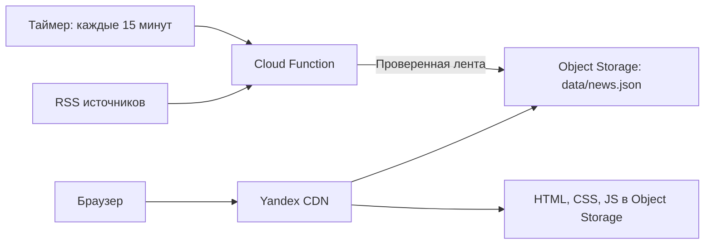

# Разбор скорости лэтипобеда.рф — 22 сентября 2026

Основной подтверждённый сбой находится на пути доставки файлов через Cloudflare. В доступной для проверки сети HTML приходит, но передача JS и CSS останавливается после первых десятков килобайт. Эти же файлы из Yandex Object Storage загружаются полностью за доли секунды. Замена S3 на VPS сама по себе не обоснована этими измерениями.

Рекомендуемый порядок: исправить HTTPS на уже созданном Yandex CDN и проверить прямую доставку через него; переключить трафик после проверки; привести деплой и кэширование к одной схеме; вынести сбор новостей в Cloud Function по таймеру; затем добавить предварительную генерацию HTML и облегчить фронтенд.

## Что проверено и где границы выводов

- Исходники frontend, оба GitHub Actions workflow, Terraform, настройки конкретного CDN, origin group, бакета и сертификата через YC CLI в режиме чтения.
- Публичный домен, его DNS, HTTP-заголовки, загрузка HTML/JS/CSS и прямые запросы к Object Storage.
- Три повторения каждого из пяти запросов, дополнительно первоначальные запросы с более длинными таймаутами. Результаты: [measurements.json](2026-09-22-measurements.json).
- Открытие сайта во встроенном браузере: заголовок страницы появился, содержимое оставалось пустым.
- Временная сборка в `/tmp`: исходная сборка дала те же имена файлов и побайтово те же JS/CSS, что находятся в production. Затем выполнен отдельный эксперимент с удалением Gravity UI.

Измерения сделаны из одной доступной сети. Это не статистика пользователей и не замер Core Web Vitals. Нет надёжного LCP/INP и профиля мобильного CPU/GPU. Точный оператор, вызывающий задержку трафика Cloudflare, не установлен. Настройки origin внутри аккаунта Cloudflare не прочитаны, поэтому наличие дополнительного Yandex CDN именно за Cloudflare не утверждается.

Код приложения, DNS и облачные ресурсы при аудите не изменялись. В репозитории добавлены только этот отчёт и измерения; экспериментальные изменения остались во временной копии.

## Как работает приложение

1. Vite собирает React-приложение в `index.html`, один JS и один CSS. Отдельного backend приложения в репозитории нет.
2. HTML содержит пустой `

`. Заголовки, первый экран, карточки и навигация создаются `createRoot(...).render(...)` после загрузки JavaScript. Подтверждение: [index.html](../../frontend/index.html), [main.jsx](../../frontend/src/main.jsx).
3. Весь лендинг импортируется сразу. Большая часть контента — статические данные из [content.js](../../frontend/src/data/content.js). Основная интерактивность: меню, модальные окна, счётчик возраста университета и новости.
4. После монтирования `NewsFeed` браузер посетителя последовательно запрашивает внешние RSS. Полноценного фонового обновления по расписанию нет: эффект запускается при монтировании.
5. Деплой загружает результат сборки в Yandex Object Storage. На внешнем контуре домена сейчас работает Cloudflare: DNS возвращает `104.21.31.116` и `172.67.176.123`, в HTTP есть `server: cloudflare` и `cf-ray: ...-ARN`.

В Yandex Cloud уже существует активный ресурс `leti-pobeda-origin-group` / CDN `bc8ry2x3jpo5z26nv6cf`, provider `ourcdn`, endpoint `e1730e1788c00604.topology.gslb.yccdn.ru`. Его origin — `xn--80abjdnrwhz3i.xn--p1ai.website.yandexcloud.net` по HTTP. Это совпадает с [cdn.tf](../../infra/terraform/cdn.tf), но ещё не доказывает маршрут origin в Cloudflare.

## Основная причина долгого открытия

Контрольная серия: обычный GET с `--compressed`, по три запроса, лимит каждого 10 секунд. Время включает соединение и получение тела; единицы размеров — десятичные КБ.

| Ресурс | Через основной домен | Напрямую из Object Storage |
| --- | --- | --- |
| HTML | 0,356–0,514 с, 3/3 успешно | В этой серии не измерялся |
| JS | 3/3 таймаута на 10 с; получено лишь 19,1–21,9 КБ | 0,275–0,338 с, 3/3 полностью; 93,7 КБ gzip |
| CSS | 3/3 таймаута на 10 с; получено лишь 19,1–21,9 КБ | 0,263–0,481 с, 3/3 полностью; 24,4 КБ gzip |

Во всех шести зависших запросах к JS/CSS Cloudflare сообщал `cf-cache-status: HIT`. Первые байты приходили примерно за 0,24–0,37 секунды. Значит, проблема воспроизводится при передаче уже закэшированного тела, а не только при ожидании origin. Первоначальные запросы с лимитами 25 секунд для JS и 20 секунд для CSS также не завершились.

Поведение согласуется с [описанным Cloudflare ограничением трафика у российских провайдеров](https://developers.cloudflare.com/support/troubleshooting/general-troubleshooting/service-disruption/). Это обоснованная гипотеза о механизме, а не доказательство ограничения конкретным провайдером пользователя. Надёжно установлен факт: в этих условиях маршрут через Cloudflare не доставляет файлы целиком, прямой маршрут к хранилищу работает.

Пустая HTML-оболочка усиливает эффект: пока JS не пришёл, пользователь не видит содержимого сайта. Предварительная генерация HTML уменьшит эту зависимость, но CSS тоже нужно доставлять по исправному маршруту.

## Почему нельзя просто выключить Cloudflare proxy

Прямое соединение с Yandex CDN с правильными Host и SNI завершается ошибкой проверки сертификата `unable to get local issuer certificate`.

Проверка TLS и Certificate Manager установила:

- Сертификат `fpq68561k6ma1l7iisee` имеет тип `IMPORTED`.
- Его issuer — Cloudflare Origin SSL Certificate Authority; CN — Cloudflare Origin Certificate.
- CDN показывает `READY`, но это не означает доверие со стороны обычного браузера.

[Cloudflare прямо описывает](https://developers.cloudflare.com/ssl/origin-configuration/origin-ca/) Origin CA как сертификат для соединения Cloudflare с origin. Для прямого посещения браузером он не подходит.

Перед переключением требуется выпустить публично доверенный сертификат, например управляемый через Yandex Certificate Manager, и подключить его к CDN. После этого проверить HTTPS и полную загрузку файлов через CDN без отключения TLS-проверки, ещё до изменения публичного DNS. Скорость Yandex CDN в текущем аудите не измерена из-за ошибки TLS.

Для сохранения адреса без `www` можно рассмотреть существующий Cloudflare DNS в режиме DNS only с CNAME flattening. Это убирает Cloudflare из HTTP-пути. Географическую маршрутизацию CDN при flattening нужно проверить отдельно. Yandex [рекомендует CNAME и предупреждает про ANAME](https://yandex.cloud/ru/docs/cdn/concepts/resource); указание в README на flattening нельзя считать доказательством идеальной геомаршрутизации. Альтернатива — обычный CNAME на `www` с HTTPS-редиректом с корня через отдельный доступный endpoint. Статический A на обнаруженный IP CDN закреплять не следует.

## Деплой и кэширование

Последний успешный [CI run](https://github.com/Open-ETU/LETIPobeda-promo/actions/runs/27163072083) относится к `master`, коммиту `226d67f`, 8 июня 2026. Время публикации совпадает с `Last-Modified` файлов, а сборка этого коммита совпала с production побайтово.

Есть два расходящихся workflow:

| Файл | Поведение | Последствие |
| --- | --- | --- |
| [ci.yml](../../.github/workflows/ci.yml) | Работает на `master`, удаляет всё содержимое бакета, затем загружает HTML раньше JS/CSS | Окно отсутствующих файлов во время публикации; старый HTML может ссылаться на уже удалённые assets |
| [deploy.yml](../../.github/workflows/deploy.yml) | Объявлен для `main`, содержит `sync --delete`, годовой кэш assets и полный purge | Не соответствует основной ветке; последние публичные запуски помечены failure; описанные README настройки нельзя считать реально применёнными |

В `deploy.yml` также есть прямое использование `secrets.*` внутри `if`; [GitHub требует передавать такие значения через поддерживаемый контекст, например env](https://docs.github.com/en/actions/how-tos/write-workflows/choose-what-workflows-do/use-secrets). Точная диагностика последних failed runs в этом аудите не получена.

На текущем origin для JS/CSS нет `Cache-Control`; через Cloudflare получается `max-age=14400`, а не годовой `immutable`. HTML приходит с `no-cache, no-store, must-revalidate` и `DYNAMIC`. Gzip работает, его отсутствие причиной не является. В Yandex CDN заданы значения edge/browser по 60 секунд; фактические заголовки на прямом CDN нужно проверить после исправления TLS, не полагаться на комментарий в Terraform.

Нужен один workflow для фактической основной ветки. Порядок публикации: новые хешированные assets → проверка доступности → HTML последним. Старые assets сохраняются на период возможного использования старого HTML и для отката; очистка выполняется отдельно. Не очищать весь бакет и весь CDN на каждый релиз.

Предлагаемые политики для проверки на конечных HTTP-ответах:

| Объекты | Политика |
| --- | --- |
| `/assets/*` с хешем | `public, max-age=31536000, immutable` |
| HTML | Короткий edge TTL; например `public, max-age=0, s-maxage=60, must-revalidate`, при поддержке выбранных правил CDN |
| `/data/news.json` | Например `public, max-age=60, s-maxage=300`; TTL согласовать с периодичностью обновления |

## Новости: Cloud Function по расписанию

Предложение пользователя подходит для этого сайта. Рекомендуется следующая схема:

Запуск Cloud Function по таймеру [поддерживается Yandex Cloud](https://yandex.cloud/ru/docs/functions/concepts/trigger/timer). Интервал 15 минут — предложение; он означает 96 плановых запусков в сутки без учёта повторов. Посетитель получает уже подготовленный JSON, поэтому задержки источников и холодный запуск функции не входят в путь отображения новостей.

Контракт обработки:

- Сначала использовать RSS. HTML-парсинг добавлять только для конкретных источников без работающей ленты, с отдельными адаптерами и проверенными селекторами.
- Загружать источники независимо с ограниченной параллельностью. Ограничить время всего запроса, включая тело, объём ответа и число повторов.
- Проверять структуру; нормализовать дату, заголовок, источник и ссылку; удалять дубли по каноническому URL; сортировать; сохранять ограниченное число записей.
- Публиковать только готовый валидный JSON. При полном сбое не затирать прошлую успешную версию. При частичном сбое сохранять предыдущие данные недоступного источника и обновлять доступные.
- Хранить `schemaVersion`, время успешного обновления, статусы/время обновления источников и `items`. Для простого превью достаточно текста и ссылки; полный HTML новости в браузере необязателен.
- На фронте получать `/data/news.json` с того же origin. Показывать сохранённые новости и дату обновления; запрашивать при приближении к блоку, если в первоначальный HTML уже включён снимок ленты.
- Отслеживать возраст последнего успешного снимка и ошибки функции. Пустой или повреждённый ответ источника не должен превращаться в успешную публикацию пустой ленты.

**Обязательная зависимость от исправления деплоя:** текущий `ci.yml` удаляет весь бакет, а `deploy.yml` удаляет отсутствующие в сборке объекты. Оба способны стереть созданный функцией `news.json`. Перед добавлением функции нужно зарезервировать `/data/` и исключить его из операций очистки/публикации frontend, либо использовать отдельный бакет с отдельной схемой доставки. Собирать новости и публиковать frontend должны разные задачи с независимыми правами.

Текущие дефекты новостей:

1. [news.js](../../frontend/src/data/news.js): источники перебираются последовательно, по 5 секунд ожидания заголовков каждый. Таймер снимается до `response.text()`, поэтому время получения тела целиком не ограничено этим таймером.
2. [NewsFeed.jsx](../../frontend/src/components/NewsFeed.jsx): резервный таймер на 6 секунд отменяется только при размонтировании. Даже после успешного раннего ответа он заменяет ленту fallback-данными и включает сообщение об ошибке.
3. Резервные записи жёстко зашиты и датированы 2025 годом. Их нельзя выдавать за актуально собранные новости.
4. В момент проверки `letitoday.ru/rss/` вернул HTTP 500 примерно за 2,54 секунды; `www.eltech.ru/rss/stud-mob-app` закрыл соединение без HTTP-ответа. Это разовые наблюдения доступности, не доказательство постоянной неисправности.
5. Прямые запросы браузера к чужим доменам дополнительно зависят от CORS. Перенос сбора на функцию и раздача JSON с домена сайта убирают эту зависимость для пользователя.

Новости не блокируют синхронно первый экран текущего приложения: их загрузка начинается в эффекте после монтирования. Поэтому перенос в функцию нужен, но сам по себе проблему пустой страницы не устранит.

## Фронтенд: что даст дополнительное ускорение

Приложение небольшое, тяжёлых изображений или видео в первоначальной сборке нет. Размеры production до распаковки браузером: JS 252 740 байт, CSS 127 581 байт. Измеренные gzip-тела на origin — 93 696 и 24 386 байт; показатели gzip в выводе сборщика ниже из-за других параметров сжатия.

Gravity UI используется только как `ThemeProvider`, но подключены его глобальные стили. Во временной копии удалены именно provider и два CSS-импорта, без изменения остальной страницы:

| Артефакт | Текущая сборка | Эксперимент без Gravity UI |
| --- | ---: | ---: |
| JS | 252,74 КБ | 228,84 КБ |
| CSS | 127,58 КБ | 42,87 КБ |
| JS gzip, отчёт Vite | 80,70 КБ | 71,93 КБ |
| CSS gzip, отчёт Vite | 18,71 КБ | 8,41 КБ |

Это около 19% экономии суммарного gzip JS+CSS в сборке. Эксперимент доказывает размер выигрыша, но не заменяет визуальную проверку перед удалением библиотеки в основной ветке. Неиспользуемые `cheerio` и `rss-parser` есть в package.json, однако их наличие в зависимостях само по себе не означает попадания в клиентский bundle.

Дополнительные меры:

- Предварительно генерировать HTML первого экрана и статических разделов. Для текущего кода возможен пререндер React с гидратацией; при более существенной переработке подходит Astro с отдельными интерактивными компонентами. [Astro описывает такую модель](https://docs.astro.build/en/concepts/islands/) как статический HTML с JavaScript там, где нужна интерактивность.
- При пререндере сделать содержимое видимым без JS: сейчас `Section` начинает с `opacity-0`, пока не сработает `IntersectionObserver`. Одной генерации текущего JSX недостаточно.
- Сохранить стабильную начальную разметку счётчика возраста для гидратации; ограничить его перерисовку маленьким компонентом. Сейчас обновляется весь `Hero` каждые 250 мс.
- Локально разместить необходимые WOFF2-шрифты, включая кириллицу, и убрать внешний Google Fonts stylesheet из критического пути. Сейчас указан `display=swap`, но CSS шрифтов остаётся внешней зависимостью.
- Упростить анимируемые blur/filter и большие backdrop-filter на мобильных устройствах после профилирования. Это возможная причина плавности прокрутки, не доказанная причина текущих сетевых зависаний.

## Выбор архитектуры

| Вариант | Что даёт | Издержки | Оценка для этого проекта |
| --- | --- | --- | --- |
| React/Vite + исправленный Yandex CDN + существующий Object Storage | Убирает выявленный проблемный HTTP-маршрут после проверки | Сертификат, DNS, деплой, кэш | Первый этап |
| Предварительно сгенерированный HTML + CDN + Object Storage + функция новостей | Первый экран не ждёт полного React bundle; меньше работы в браузере; сбор RSS вне запросов посетителя | Пререндер/гидратация либо перенос статических секций в Astro | Целевая схема |
| VPS с Nginx/Caddy и статикой | Контроль над раздачей и простой A/AAAA для корневого домена | Обновления, TLS, резервирование, наблюдение за сервером | Допустим при желании управлять сервером; преимущества над исправным CDN ещё не измерены |
| SSR на каждый запрос | Генерирует HTML во время обращения | Серверная эксплуатация или холодный старт, кэширование динамических ответов | Для существующего в основном статического лендинга не выглядит оправданным |

## Последовательность реализации и проверка результата

1. Подготовить публичный сертификат и проверить Yandex CDN с сохранением TLS-валидации до DNS-переключения. Подтвердить полную передачу HTML/JS/CSS, gzip, правильные MIME и кэш.
2. Свести публикацию к одному workflow на `master`: assets сначала, HTML последним, сохранение старых релизов и `/data/`, без массовой очистки.
3. Переключить HTTP-трафик на проверенный CDN, сохранив возможность вернуть прежнюю DNS-конфигурацию. Проверить с домашнего и мобильного подключения в РФ без VPN; отдельно проверить другой регион.
4. Внедрить функцию сборки новостей и таймер, сделать валидированный снимок и сохранение последней успешной версии. Проверить полный и частичный сбой источников, повторный запуск и независимость от frontend deploy.
5. Облегчить CSS/JS, локализовать шрифты, добавить пререндер или SSG. Проверить видимость контента без JS и отсутствие ошибок гидратации.
6. Измерить холодную/повторную загрузку в браузере на целевом мобильном профиле и реальных сетях. Проектные ориентиры: LCP ≤ 2,5 с, INP ≤ 200 мс, CLS ≤ 0,1; это цели последующей проверки, не результаты текущего аудита.

Критерий первого этапа — исчезновение остановок передачи JS/CSS на реальных подключениях. Число «0,3 секунды» выше относится к отдельным запросам из измерительной сети и не является обещанием такого времени открытия всего сайта.
